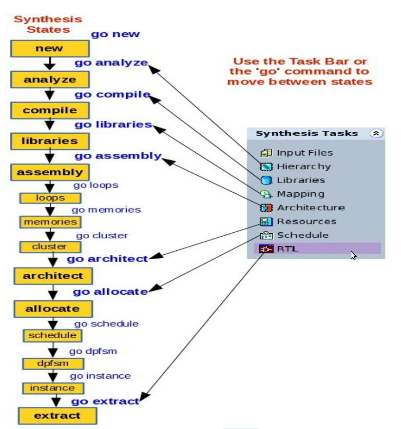

# Synthesis of a HLS4ML Project with Catapult HLS

This **hls4ml** project supports `ac_fixed` and `ac_int` arbitrary-precision datatypes provided with Catapult HLS. There are few differences between `sc_fixed`, `sc_int` and `ac_fixed`, `ac_int`.  

- The project **runs Catapult HLS**.
- The project has been generated with [keras-config.yml](./keras-config.yml) and manually modified.
  ```
  ../../scripts/hls4ml convert -c keras-config.yml
  ```
- The model is a simple [MNIST classifier](https://github.com/GiuseppeDiGuglielmo/MLP-examples/tree/master/keras/mnist) (MLP `784x256x256x10`).
- The generators have not been modified.
- The Vivado's [hls4ml/templates/vivado/nnet_utils](../../../hls4ml/templates/vivado/nnet_utils) have been modified to support Catapul HLS.
- In the future we will have `hls4ml/templates/catapult`.

## Implementation Notes

- Remapping of `ap_fixed<>` from the Arbitrary Precision datatype library to `ac_fixed<>` from the Algorithmic C datatype library (which has differencies w.r.t. SystemC `sc_fixed<>` and `sc_int<>`). See [inc](./inc) folder.
  ```
  #include <ac_int.h>
  #include <ac_fixed.h>

  template<int W>
  using ap_int = ac_int<W, true>;

  template<int W>
  using ap_uint = ac_int<W, false>;

  template<int W, int I>
  using ap_fixed = ac_fixed<W,I,true>;

  template<int W, int I>
  using ap_ufixed = ac_fixed<W,I,false>;
  ```

- Vivado HLS has a wider support for fixed/floating point arithmetic. Catapult HLS may
  - not support the synthesis of some operators (e.g. division `/`, it is necessary to use various functions that implement those operators)
  - have problems with implicit casts (e.g. it is necessary to make everything explicit)
  - have more *arithmetic functions* for the `ac_fixed` and `ac_int` w.r.t. `sc_fixed` and `sc_int` (e.g. `mgc_ac_exp` and `mgc_ac_log` (CORDIC) are not provided for `sc_fixed`)
  - have limited support for floating point arithmetic, thus it is necessary to convert the functions from float to fixed point. For example:
    ```
    // *************************************************
    //       Softplus Activation
    // *************************************************
    #ifdef MNTR_CATAPULT_HLS
    inline ac_fixed<18,8,true> softplus_fcn_float(ac_fixed<18,8,true> input) {
       ac_fixed<18,8,true> _exp; mgc_ac_exp(input, _exp);
       ac_fixed<18,8,true> _log; mgc_ac_log(_exp, _log);
       return _log + ac_fixed<18,8,true>(1.);
     }
     #else
     inline float softplus_fcn_float(float input) {
       return std::log(std::exp(input) + 1.);
     }
     #endif
     ```
   This porting requires some error propagation analysis to avoid overflow and lost of precision.

- Some headers are included multiple times. This is fine with GCC, but not with Modelsim (simulation). We should fix this in any case also for the standard Xilinx flow.
  - [my-hls-test/myproject_test.cpp](my-hls-test/myproject_test.cpp)
  - [my-hls-test/firmware/parameters.h](my-hls-test/firmware/parameters.h)
  - [my-hls-test/firmware/myproject.h](my-hls-test/firmware/myproject.h)
  - [my-hls-test/firmware/myproject.cpp](my-hls-test/firmware/myproject.cpp)

- Change the Streaming data interface.
  ```
  #include "hls_stream.h"
  hls::stream< data_T > &data
  ```
  to
  ```
  #include "ac_channel.h"
  ac_channel< data_T > &data
  ```
  
- The synthesis time runs a little high for SoftMax layer, but it should be possible to fix it.
  ```
  # Info: Running transformation 'schedule' on solution 'nnet__softmax_result_t_result_t_softmax_config4__010e30973ea6d05ff01ff02f57fe4706e9aafd.v1': elapsed time 938.12 seconds, memory usage 3280436kB, peak memory usage 3313584kB (SOL-15)
  # Info: Running transformation 'dpfsm' on solution 'nnet__softmax_result_t_result_t_softmax_config4__010e30973ea6d05ff01ff02f57fe4706e9aafd.v1': elapsed time 27.38 seconds, memory usage 3345972kB, peak memory usage 3345972kB (SOL-15)
  ```

- Catapult HLS uses pragma, but TCL directives are preferable
  - See `directive` in [syn/project.tcl](syn/project.tcl)
  - Many of the directives that are required in Vivado HLS for [../../keras-to-hls/keras-config.yml](../../keras-to-hls/keras-config.yml) (io_parallel ---> loop unrolls) are a default for Catapult HLS, thus they are not specified in the TCL file [syn/project.tcl](syn/project.tcl)
  - More in general, have a look at the manual for the Catapult HLS flow and pragmas
    

- Some of these changes are under conditional macros.
  ```
  #ifdef MNTR_CATAPULT_HLS
    // Catapult HLS code
  #else
    // Vivado HLS code
  #endif
  ```

## Simulation (w/out licenses)

You still need Catapult HLS installed on your local machine. Update the
`sim/envsetup.sh` and to match the installation paths on your local machine.
Finally:

Use a new console.
```
cd sim
source envsetup-mntr.sh
make clean
make run
```

**Please, note that we are using the `ac_fixed` and `ac_int` datatypes and the
`g++` compiler in the Catapult HLS installation.**

## Synthesis

You need Catapult HLS installed on your local machine. Update the
`syn/envsetup.sh` script to match the installation paths on your local machine.
This script exports also the environment variable for the Mentor licenses.
Finally:

Use a new console.
```
cd syn
source envsetup.sh
make hls-solution1-sh
```
